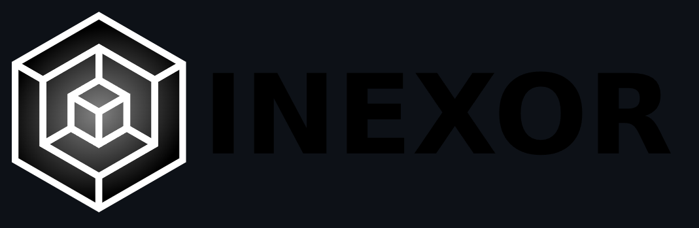
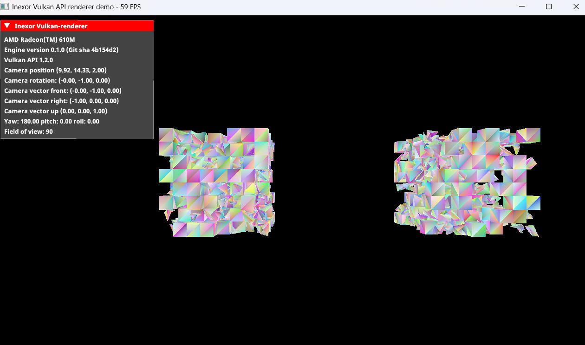

# Log 1
## Chosen Project
  
I've found my project which I want to contribute to, which is an open source graphics rendering software using vulkan, called [inexor-vulkan-renderer](https://github.com/inexorgame/vulkan-renderer). I chose this project as it could familiarize me with graphics and graphics rendering, which is has varius applications in AI, game development engines, modelling software etc.

## Goals
- Get a build of the github repositry working on my machine
- Familiarize myself with the [Development Guide](https://inexor-vulkan-renderer.readthedocs.io/en/latest/index.html#)
- Read up on the [Vulkan Tutorial](https://vulkan-tutorial.com/) and learn more about the API
- Find issues on the GitHub page that would be a feasible start for me
- interact with the creator to ask questions I might have
- Come out with enough knowledge to be able to build my own Graphics Rendering application in the future

## Starting the project
### Getting a working build
To begin, I had to get a build working on my device, which required me to use Visual Studio as my IDE as that's what has the best support. I then had to install Vulkan SDK, a set of tools and libraries required to work with the Vulkan API, and CMake, a project builder which allows for compatability between varius operating systems. Once I'd done that, I managed to get a build working on my device.

### Reading development guidelines / structure

### What I learned