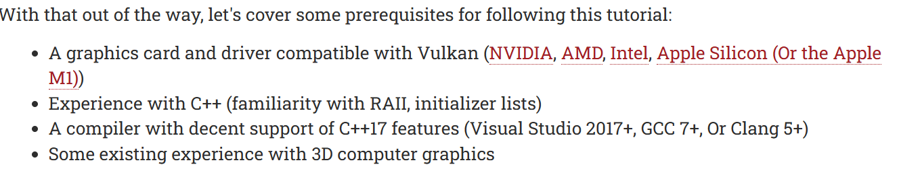

# Log 2
## Learning Vulkan
To actually contribute, I need to learn a bit off of the vulkan engine so i'll be using [this](https://vulkan-tutorial.com/) and these [videos](https://www.youtube.com/watch?v=EsEP9iJKBhU&list=PLA0dXqQjCx0RntJy1pqje9uHRF1Z5vZgA&t=3s&ab_channel=OGLDEV) as a resource for learning as outlined in my goals.

### Prerequisites

I'm not familiar with RAII nor initializer lists, so I thought I quickly look over those 2.

I decided to start by setting up a new C++ project to begin testing, however I quickly struggled as development with C++ is primarily done in visual studio, and I haven't used visual studio in over a year to develop anything thus se